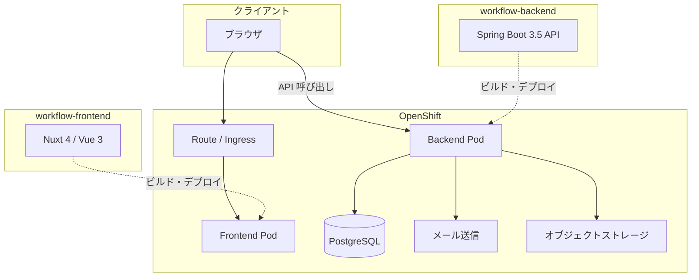

# 設計仕様書

## 1. 概要

### 1.1 目的

本ドキュメントは、[プロダクト要求仕様書](./product-requirements.md) に基づき、申請ワークフローシステムの技術設計・構成を定義する。実装・API 仕様・デプロイ作業の前提となる。

### 1.2 関連ドキュメント

| ドキュメント | 説明 |
|--------------|------|
| [product-requirements.md](./product-requirements.md) | プロダクト要求仕様（What） |
| design.md（本書） | 設計仕様（How の骨格） |
| [api-spec.md](./api-spec.md) | API 仕様（正式定義） |
| [specs/](./specs/) | 機能別仕様・受け入れ条件 |

## 2. システム構成

### 2.1 全体アーキテクチャ

本システムは **フロントエンド（Nuxt）** と **バックエンド（Spring Boot）** を分離した構成とし、フロントエンドからバックエンドの API へ HTTP でアクセスする。



### 2.2 リポジトリ構成

フロントエンド・バックエンド・OpenShift マニフェストは **別 Git リポジトリ** で管理する。計 3 リポジトリ構成。システム名は **workflow** とする。

| リポジトリ名 | 役割 | 主な内容 |
|--------------|------|----------|
| `workflow-backend` | API・ドメインロジック・DB | Spring Boot アプリケーション |
| `workflow-frontend` | UI | Nuxt アプリケーション |
| `workflow-manifests` | OpenShift デプロイ定義 | Deployment, Service, Route, ConfigMap, Secret 等 |

- CI/CD はプラットフォームチームが用意した既存パイプラインに準拠する。アプリケーション側はそのパイプラインが要求する構成・ビルド手順に合わせて実装する（パイプライン定義自体は本プロジェクトのスコープ外）。

### 2.3 CI/CD

- ビルド・デプロイのパイプラインは **プラットフォームチームが提供済み** であり、本システムもそれに準拠する。
- `workflow-backend` / `workflow-frontend` では、パイプラインが想定するビルドコマンド・成果物（コンテナイメージ等）を出力するようプロジェクトを構成する。
- `workflow-frontend` は **Node.js アプリ**としてビルド・デプロイする（Nuxt / Nitro。§5.1 参照）。
- `workflow-manifests` は、パイプラインまたは運用手順に従い OpenShift へ反映する。
- パイプラインの詳細仕様・設定変更はプラットフォームチームの管轄とし、本設計書では個別定義しない。

### 2.4 デプロイ先

- **本番・検証環境**: OpenShift
- マニフェストリポジトリに Kubernetes / OpenShift リソース定義を置き、環境ごとの差分（ConfigMap / Secret、レプリカ数等）を管理する（詳細は **TBD**）。

---

## 3. 技術スタック

### 3.1 バックエンド

| 項目 | 技術 |
|------|------|
| 言語 | Java 25 |
| フレームワーク | Spring Boot 3.5 |
| ビルド | Maven（Maven Wrapper 同梱: `./mvnw`） |
| DB | PostgreSQL |
| マイグレーション | Flyway |
| テスト | JUnit 5 / AssertJ / Rest Assured |
| 静的解析 | Checkstyle / PMD / SpotBugs |

### 3.2 フロントエンド

| 項目 | 技術 |
|------|------|
| フレームワーク | Nuxt 4 / Vue 3 |
| 言語 | TypeScript |
| レンダリング | SPA（`ssr: false`） |
| 本番ランタイム | Node.js（Nitro サーバー） |
| テスト | Vitest / Testing Library |
| フォーマッタ | Prettier |

### 3.3 フロントエンドとバックエンドの連携

- フロントエンド（Nuxt）からバックエンド API へ直接 HTTP リクエストを送る。
- 認証は **セッション（Cookie）** 方式とする。API 呼び出し時は Cookie を送信する（`credentials: 'include'` 等）。
- API のベース URL は環境変数等で切り替える。検証・本番の値は **TBD**（OpenShift Route 確定後）。

**ローカル開発（接続設定）**

| 項目 | 値 |
|------|-----|
| フロントエンド（Nuxt `npm run dev`） | `http://localhost:3000` |
| CORS 許可オリジン（バックエンド） | `http://localhost:3000` |
| API ベース URL（フロント → バックエンド） | `http://localhost:8080`（例。環境変数名は **TBD**） |

### 3.4 API 設計

- API 形式は **REST** とする。リソースを URL で表し、HTTP メソッド（`GET` / `POST` / `PUT` / `PATCH` / `DELETE`）で操作する。
- API の正式定義は **[api-spec.md](./api-spec.md)** とする。エンドポイント、リクエスト/レスポンス、認可ルール、ワークフロー制約を本書に集約する。
- **OpenAPI / `openapi.yaml` は採用しない**（D-17）。型の自動生成や Swagger UI が必要になった場合は、実装後に Springdoc 等でコードから生成する方式を検討する。

| 成果物 | 配置 | 役割 |
|--------|------|------|
| `api-spec.md` | `docs/`（本リポジトリ） | API の正式仕様 |

### 3.5 エラーレスポンス（RFC 7807）

API のエラーレスポンスは **[RFC 7807](https://datatracker.ietf.org/doc/html/rfc7807) Problem Details** で統一する。

| 項目 | 値 |
|------|-----|
| Content-Type | `application/problem+json` |
| スキーマ定義 | [api-spec.md §2.4](./api-spec.md#24-エラーレスポンス) で定義 |

**標準フィールド**

| フィールド | 必須 | 説明 |
|------------|------|------|
| `type` | 推奨 | 問題の種類を識別する URI（例: `https://workflow.example.com/problems/validation-error`） |
| `title` | 推奨 | 問題の短い概要（同一 `type` では不変） |
| `status` | 推奨 | HTTP ステータスコード |
| `detail` | 推奨 | この発生事象に固有の説明（画面表示の主な文言） |
| `instance` | 任意 | このエラーが発生したリクエスト URI |

**レスポンス例（否認コメント未入力）**

```json
{
  "type": "https://workflow.example.com/problems/validation-error",
  "title": "Validation Error",
  "status": 400,
  "detail": "否認時はコメントが必須です",
  "instance": "/api/applications/100/reject"
}
```

- バリデーションエラーで複数フィールドがある場合は、RFC 7807 の拡張フィールド `errors` 配列を用いる（[api-spec.md §2.4](./api-spec.md#24-エラーレスポンス)）。
- バックエンドは Spring Boot の Problem Details 対応（`ProblemDetail` / `@ControllerAdvice`）を利用する。
- フロントエンドは `detail` をユーザー向けメッセージとして表示し、`type` または HTTP `status` で分岐する。

**主な HTTP ステータスと用途**

| ステータス | 用途 |
|------------|------|
| 400 | バリデーションエラー、業務ルール違反 |
| 401 | 未認証 |
| 403 | 認可エラー（他人の申請へのアクセス等） |
| 404 | リソース未存在 |
| 409 | 状態遷移の競合（承認済み申請への再申請等） |
| 500 | サーバー内部エラー |

---

## 4. バックエンド設計

### 4.1 レイヤ構成（方針）

Spring Boot の一般的なレイヤ分割を採用する。

```
controller   … HTTP エンドポイント、リクエスト/レスポンス変換
service      … ユースケース、トランザクション、ドメインルール
repository   … DB アクセス（Spring Data JPA 等、選定は TBD）
domain       … エンティティ、値オブジェクト、ドメインイベント（必要に応じて）
```

- 認証方式の差し替え（将来 OIDC 移行）を意識し、認証・認可は専用の設定・インターフェースに集約する（初版はセッション認証、§6 参照）。

### 4.2 データベース

- RDBMS として PostgreSQL を使用する。
- スキーマ変更は Flyway マイグレーションで管理する。
- マイグレーションファイルは `workflow-backend` リポジトリ内に配置する（パスは実装時に決定）。

### 4.2.1 ユーザー管理（初版）

- 初版ではユーザー管理画面・管理 API は作らない（[product-requirements.md §8](./product-requirements.md#8-スコープ外初版) のスコープ外と整合）。
- ユーザー・承認者フラグ等の初期データは、Flyway のシードマイグレーション（または同等のインポート手段）で投入する。
- 環境ごとにシード内容を変える必要がある場合は、プロファイル別マイグレーション等で対応する（詳細は実装時に決定）。

### 4.3 主要ドメインモデル（案）

[product-requirements.md](./product-requirements.md) に基づく論理モデル。物理テーブル設計は API 仕様策定時に詳細化する。

| エンティティ | 概要 |
|--------------|------|
| User | ログインユーザー。承認者フラグ（`is_approver`）を持つ |
| Application | 申請の本体。種別・ステータス・申請者・承認者を保持 |
| LeaveApplicationDetail | 休暇申請の詳細（from, to, 理由） |
| PurchaseApplicationDetail | 物品購入申請の詳細（品名、金額） |
| Attachment | 物品購入申請の添付ファイル（任意） |
| ApprovalAction | 承認・否認の履歴（アクション種別、コメント、実行者、日時） |

**申請ステータス**（列挙）: `PENDING`（申請中） / `APPROVED`（承認済み） / `REJECTED`（否認）

**申請種別**（列挙）: `LEAVE`（休暇） / `PURCHASE`（物品購入）

### 4.4 承認ワークフロー

| 操作 | コメント | 備考 |
|------|----------|------|
| 承認 | 任意 | 入力があれば `ApprovalAction` に記録し、通知メールに含める |
| 否認 | **必須** | 未入力の場合は API・UI ともにエラーとする。否認理由を申請者へ通知する |

**再申請（否認後の修正）**

- 否認された申請は、**同一 `Application` レコードを更新**して再提出する（新規レコードは作成しない）。
- 再申請時はステータスを `REJECTED` → `PENDING` に戻し、申請内容（種別ごとの詳細項目・承認者等）を更新できる。
- 申請 ID・URL は再申請前後で変わらない（例: `/applications/100` のまま）。
- 否認・承認の履歴は `ApprovalAction` に蓄積し、過去の否認コメント等を参照できる。
- `APPROVED` の申請は再申請・再編集不可（[product-requirements.md §6.2](./product-requirements.md#62-状態遷移)）。

```
申請 ID=100（同一レコード）
  申請 → PENDING
  否認 → REJECTED（ApprovalAction に記録）
  修正・再申請 → PENDING（`ApprovalAction` に `RESUBMIT` を記録。[api-spec.md §5.3](./api-spec.md#53-再申請時の履歴)）
  承認 → APPROVED
```

### 4.5 添付ファイル

- 物品購入申請のみ、任意で添付できる（[product-requirements.md §3.3](./product-requirements.md#33-物品購入申請)）。
- ファイル本体は **オブジェクトストレージ** に保存する。DB（`Attachment`）にはオブジェクトキー・ファイル名・MIME タイプ等のメタデータのみ保持する。
- バックエンドは **S3 互換 API** 経由でオブジェクトストレージへアップロード／取得する（AWS SDK for Java 2.x の S3 クライアント等。エンドポイント・認証情報は環境ごとに設定）。

**オブジェクトストレージ（環境別）**

| 環境 | 製品 | 備考 |
|------|------|------|
| 開発（ローカル） | [RustFS](https://github.com/rustfs/rustfs) | S3 互換 API のローカルサーバー。fake-smtp-server と同様、開発専用 |
| 検証・本番 | S3 互換 API を提供するストレージ | プラットフォーム／インフラ側が提供。MinIO、クラウドオブジェクトストレージ等を想定 |

- 実装は **S3 API 共通** とし、接続先（エンドポイント・バケット・認証情報）の差し替えのみで環境を切り分ける。
- バケット名・オブジェクトキーの命名規則は [api-spec.md §7.2](./api-spec.md#72-オブジェクトストレージ) で定義。

**開発環境（RustFS）**

| 項目 | 値（例） |
|------|----------|
| リポジトリ | https://github.com/rustfs/rustfs |
| S3 API エンドポイント | `http://localhost:9000`（既定。RustFS の設定に従う） |
| 管理コンソール | `http://localhost:9001`（有効時） |
| 認証 | アクセスキー・シークレットキー（RustFS 起動時の環境変数で設定） |
| パススタイルアクセス | S3 互換サーバー向けに有効化する |

起動例（`workflow-backend` の README で詳細を規定）:

```bash
podman run -d --name workflow-rustfs \
  -p 9000:9000 -p 9001:9001 \
  -e RUSTFS_ACCESS_KEY=rustfsadmin \
  -e RUSTFS_SECRET_KEY=rustfsadmin123 \
  docker.io/rustfs/rustfs
```

**バックエンド（`dev` プロファイル）接続設定（案）**

| 設定 | 値（例） |
|------|----------|
| エンドポイント | `http://localhost:9000` |
| バケット | `workflow-attachments-dev`（[api-spec.md §7.2](./api-spec.md#72-オブジェクトストレージ)） |
| アクセスキー / シークレットキー | RustFS 起動時と同一 |
| パススタイルアクセス | `true` |

**検証・本番環境**

- インフラが提供する S3 互換エンドポイントへ接続する。
- 接続情報（エンドポイント、バケット、認証情報）は `workflow-manifests` の ConfigMap / Secret で注入する。

**制約**

| 項目 | 値 |
|------|-----|
| 最大サイズ | 3 MB（3,145,728 バイト） |
| 許可形式 | PDF、Excel（`.pdf` / `.xls` / `.xlsx`） |

**許可 MIME タイプ**

| 形式 | MIME タイプ |
|------|-------------|
| PDF | `application/pdf` |
| Excel（.xlsx） | `application/vnd.openxmlformats-officedocument.spreadsheetml.sheet` |
| Excel（.xls） | `application/vnd.ms-excel` |

- サイズ超過・未許可形式の場合は、API・UI ともにエラーとする。
- バリデーションはファイルサイズに加え、拡張子と MIME タイプの両方で検証する（Content-Type の偽装対策）。

### 4.6 横断関心事

| 関心事 | 方針 |
|--------|------|
| 認証 | セッション認証（Cookie）。本システム内でユーザー ID・パスワードを管理。将来 OIDC へ移行可能な抽象化（§6） |
| 認可 | 申請者は自分の申請のみ、承認者は自分宛ての申請のみ操作可能 |
| メール通知 | Spring Mail による SMTP 送信（§7）。開発環境は [fake-smtp-server](https://github.com/gessnerfl/fake-smtp-server) を使用 |
| 添付ファイル | 物品購入申請のみ任意。オブジェクトストレージに保存（§4.5） |
| バリデーション | API 層およびドメイン層で入力検証 |
| エラーハンドリング | RFC 7807 Problem Details（`application/problem+json`）。§3.5 参照 |

### 4.7 テスト方針（バックエンド）

| 種別 | ツール | 対象 |
|------|--------|------|
| 単体テスト | JUnit 5, AssertJ | サービス層、ドメインロジック |
| API テスト | Rest Assured | エンドポイント、認証・認可、ステータス遷移 |
| 静的解析 | Checkstyle, PMD, SpotBugs | コード品質・バグパターン検出 |

---

## 5. フロントエンド設計

### 5.1 構成方針

- Nuxt 4 のファイルベースルーティングで画面を構成する。
- TypeScript を全面使用する。
- API 呼び出しは composable または専用 API クライアント層に集約する（詳細は **TBD**）。

**レンダリング・デプロイ（D-08）**

| 項目 | 方針 |
|------|------|
| レンダリングモード | **SPA**（`ssr: false`）。画面描画とデータ取得はブラウザ側で行い、Spring Boot API を呼ぶ |
| 本番デプロイ | **Node.js（Nitro）** サーバーで配信。標準 CI/CD の Node.js アプリビルドに準拠する |
| 設定 | `nuxt.config` で `ssr: false` |

**ビルド・起動（案）**

| コマンド | 用途 |
|----------|------|
| `npm run dev` | ローカル開発（Nuxt 開発サーバー） |
| `npm run build` | 本番ビルド（`nuxt build` → `.output/` 生成） |
| `node .output/server/index.mjs` | 本番起動（Nitro） |

- SPA モードでも `nuxt build` は Nitro による Node.js サーバーを生成する。静的ファイルのみを nginx 単体で配信する構成は採用しない。
- クライアントサイドルーティング（`/applications/:id` 等）は Nitro 側でフォールバック設定される。

### 5.2 画面一覧（案）

[product-requirements.md](./product-requirements.md) の機能要件に対応する画面。

| 画面 | パス（案） | 対象ロール | 説明 |
|------|------------|------------|------|
| ログイン | `/login` | 全員 | 認証 |
| 申請作成 | `/applications/new` | 申請者 | 種別選択・入力・送信 |
| 申請一覧（申請者） | `/applications` | 申請者 | 自分の申請一覧 |
| 申請詳細（申請者） | `/applications/:id` | 申請者 | 詳細閲覧・否認時の修正・再申請 |
| 承認待ち一覧 | `/approvals` | 承認者 | 自分宛て申請一覧 |
| 承認詳細 | `/approvals/:id` | 承認者 | 詳細閲覧・承認/否認 |

- ルーティング・レイアウトの最終形は実装時に調整可能。

### 5.3 テスト方針（フロントエンド）

| 種別 | ツール | 対象 |
|------|--------|------|
| 単体・コンポーネントテスト | Vitest, Testing Library | コンポーネント、composable |
| フォーマット | Prettier | コードスタイル統一 |

---

## 6. 認証・セキュリティ

### 6.1 初版（セッション認証）

- ユーザーは本システム内の認証情報でログインする（[product-requirements.md §2](./product-requirements.md#2-認証アクセス)）。
- 認証方式は **セッション（Cookie）** とする。ログイン成功後、バックエンドがセッションを発行し、以降の API リクエストで Cookie によりセッションを検証する。
- パスワードは平文で保存しない。**BCrypt** でハッシュ化して保存する。
- Spring Security の `BCryptPasswordEncoder` を使用する。コスト係数（strength）は **10**（ライブラリ既定）とする。
- ログイン時は `passwordEncoder.matches(入力値, 保存済みハッシュ)` で検証する。Flyway シードの初期ユーザーもハッシュ済みパスワードで投入する。
- セッション Cookie は `HttpOnly` とし、本番環境では `Secure`・適切な `SameSite` を設定する。
- ログアウト時はサーバー側でセッションを無効化する。
- セッションの保存先は **インメモリ**（Spring Security のデフォルトセッションストア）とする。初版は Redis 等の外部ストアは使わない。
- インメモリのため、**Pod 再起動・デプロイでセッションは失効**する。複数レプリカ間でのセッション共有は行わない（初版は `workflow-backend` を単一レプリカ想定、またはスティッキーセッションは **TBD**）。
- 将来、レプリカ複数化や OIDC 移行時に Redis 等へ差し替え可能なよう、セッション管理は抽象化しておく。

**フロントエンド（Nuxt）との連携**

- ブラウザから API を呼ぶ際、Cookie を送受信する（例: `fetch` の `credentials: 'include'`）。
- CORS では `Access-Control-Allow-Credentials: true` を設定し、フロントエンドのオリジンのみを許可する。

**CORS 許可オリジン**

| 環境 | 許可オリジン |
|------|--------------|
| ローカル開発（`dev` プロファイル） | `http://localhost:3000` |
| 検証・本番 | **TBD**（OpenShift のフロントエンド Route URL 確定後） |

- バックエンド（`dev` プロファイル）では `http://localhost:3000` のみ許可する。ワイルドカード（`*`）は Cookie 認証と併用できないため使用しない。
- 許可メソッド・ヘッダーは REST API 利用に必要な範囲（例: `GET`, `POST`, `PUT`, `PATCH`, `DELETE`, `OPTIONS` / `Content-Type` 等）とする。

**主要 API（案）**

| エンドポイント | 説明 |
|----------------|------|
| ログイン | 認証情報を検証しセッションを発行 |
| ログアウト | セッションを無効化 |
| 現在ユーザー取得 | ログイン中のユーザー情報を返す |

### 6.2 将来対応（OIDC）

- 認証処理をインターフェースで抽象化し、OIDC プロバイダーへの差し替えを可能にする。
- 初版のセッション認証実装は OIDC 移行時に影響しないよう、Spring Security の設定を分離する。OIDC 移行後もセッションまたは相当するサーバー側認証状態の管理を継続する想定とする。

### 6.3 API セキュリティ

- 認証済みユーザーのみ API を利用可能とする（ログイン API を除く）。
- 未認証アクセスは `401 Unauthorized` を返す。
- CORS 設定: フロントエンドのオリジンのみ許可、`Allow-Credentials` を有効化。ローカル開発は `http://localhost:3000`（§6.1）。検証・本番は **TBD**。

---

## 7. 通知設計

[product-requirements.md §5](./product-requirements.md#5-通知) に基づく。

### 7.1 通知イベント

| イベント | 通知先 | トリガー元 |
|----------|--------|------------|
| 申請送信 | 承認者 | バックエンド（申請作成 API） |
| 承認 | 申請者 | バックエンド（承認 API） |
| 否認 | 申請者 | バックエンド（否認 API） |
| 再申請 | 承認者 | バックエンド（再申請 API） |

### 7.2 メール送信の実装

| 項目 | 方針 |
|------|------|
| 実装 | **Spring Mail** による SMTP 送信 |
| 開発環境 | [fake-smtp-server](https://github.com/gessnerfl/fake-smtp-server) を SMTP サーバーとして起動し、アプリから SMTP で送信する |
| 検証・本番環境 | 実 SMTP サーバーへ送信（接続情報は ConfigMap / Secret で管理） |

**開発環境（fake-smtp-server）**

開発用フェイク SMTP サーバーには **[gessnerfl/fake-smtp-server](https://github.com/gessnerfl/fake-smtp-server)** を使用する。受信メールはインメモリに保存され、Web UI で確認できる。

| 項目 | 値（デフォルト） |
|------|------------------|
| リポジトリ | https://github.com/gessnerfl/fake-smtp-server |
| Docker イメージ | `gessnerfl/fake-smtp-server`（Podman で `docker.io/gessnerfl/fake-smtp-server` として取得） |
| SMTP ポート | `8025`（`fakesmtp.port` / `FAKESMTP_PORT`） |
| Web UI | `http://localhost:8080`（`server.port`） |
| SMTP 認証 | 無効（開発では Spring Mail から認証なしで接続） |

**起動方法（いずれか）**

- Podman: `podman run -p 8025:8025 -p 8080:8080 docker.io/gessnerfl/fake-smtp-server`（§9.3 参照）
- JAR: [Releases](https://github.com/gessnerfl/fake-smtp-server/releases) から取得し `java -jar fake-smtp-server-<version>.jar`
- ソース: `./gradlew bootRun`

**バックエンド（`workflow-backend`）の接続設定（`dev` プロファイル例）**

| 設定 | 値（例） |
|------|----------|
| `spring.mail.host` | `localhost` |
| `spring.mail.port` | `8025` |

- Spring プロファイル（例: `dev`）で SMTP 接続先を切り替える。
- 送信コードは環境共通とし、接続先の差し替えのみで開発／本番を切り分ける（モック実装への差し替えは行わない）。
- **ポート競合**: fake-smtp-server の Web UI 既定ポート（`8080`）は Spring Boot API と競合しうる。ローカルでは fake-smtp-server の `server.port` を変更するか、バックエンドの `server.port` をずらして運用する（詳細は `workflow-backend` の README で規定）。

**検証・本番環境**

- 組織の SMTP サーバー（ホスト、ポート、TLS、認証情報）へ Spring Mail から送信する。
- SMTP 認証情報は `workflow-manifests` の Secret で注入する。

**設定項目（案）**

| 設定 | 説明 |
|------|------|
| `spring.mail.host` | SMTP ホスト |
| `spring.mail.port` | SMTP ポート |
| `spring.mail.username` / `password` | 認証（本番。開発では未使用可） |
| `spring.mail.properties.mail.smtp.*` | TLS 等 |

- メール本文の形式・詳細リンクは [api-spec.md §8](./api-spec.md#8-通知メール副作用) で定義。

---

## 8. マニフェストリポジトリ（方針）

`workflow-manifests` リポジトリで OpenShift へのデプロイ用リソースを管理する。

### 8.1 想定リソース（案）

| リソース | 対象 |
|----------|------|
| Deployment | フロントエンド Pod（Node.js / Nitro）、バックエンド Pod |
| Service | 各 Deployment への内部通信 |
| Route（または Ingress） | 外部公開 |
| ConfigMap | 非機密設定（API URL 等） |
| Secret | DB 接続情報、SMTP 認証情報、オブジェクトストレージ認証情報等 |

- 環境（dev / staging / prod）の分け方、Kustomize / Helm の利用有無は **TBD**。
- PostgreSQL をクラスタ内で運用するか、マネージド DB を使うかは **TBD**。

---

## 9. ローカル開発環境（方針）

ローカル開発で必要な依存サービス（PostgreSQL、メール、オブジェクトストレージ）は **Podman コンテナ** で起動する。アプリケーション本体（バックエンド・フロントエンド）はホスト上で直接実行する。

### 9.1 コンテナランタイム

| 項目 | 方針 |
|------|------|
| ツール | **Podman** |
| 対象 | PostgreSQL、fake-smtp-server、RustFS 等の開発用依存サービス |
| イメージ取得 | 公開レジストリ（`docker.io` 等）から取得。`podman run` で起動 |

- ローカル開発手順の詳細（コンテナ名、ボリューム、再起動手順）は `workflow-backend` の README で規定する。

### 9.2 コンポーネント一覧

| コンポーネント | 想定 |
|----------------|------|
| バックエンド | `./mvnw spring-boot:run`（ホスト） |
| フロントエンド | `npm run dev`（ホスト） |
| PostgreSQL | Podman コンテナ（`postgres` イメージ） |
| オブジェクトストレージ | Podman コンテナ（[RustFS](https://github.com/rustfs/rustfs)） |
| メール | Podman コンテナ（[fake-smtp-server](https://github.com/gessnerfl/fake-smtp-server)） |

### 9.3 依存サービス起動例

**PostgreSQL**

```bash
podman run -d --name workflow-postgres \
  -e POSTGRES_DB=workflow \
  -e POSTGRES_USER=workflow \
  -e POSTGRES_PASSWORD=workflow \
  -p 5432:5432 \
  -v workflow-postgres-data:/var/lib/postgresql/data \
  docker.io/library/postgres:16
```

| 項目 | 値（例） |
|------|----------|
| ホスト / ポート | `localhost:5432` |
| DB 名 | `workflow` |
| ユーザー / パスワード | `workflow` / `workflow` |

**fake-smtp-server（メール）**

```bash
podman run -d --name workflow-fake-smtp \
  -p 8025:8025 -p 8080:8080 \
  docker.io/gessnerfl/fake-smtp-server
```

**RustFS（オブジェクトストレージ）**

```bash
podman run -d --name workflow-rustfs \
  -p 9000:9000 -p 9001:9001 \
  -e RUSTFS_ACCESS_KEY=rustfsadmin \
  -e RUSTFS_SECRET_KEY=rustfsadmin123 \
  docker.io/rustfs/rustfs
```

- フロントエンド・バックエンドを別リポジトリで同時に動かす手順は README に記載する（未作成）。

---

## 10. 決定事項・未決定事項

### 10.1 決定済み

| ID | 項目 | 決定内容 |
|----|------|----------|
| D-03 | ユーザー管理（初版） | 管理画面・管理 API は作らない。Flyway シード等で初期ユーザーをインポートする |
| D-09 | リポジトリ名 | `workflow-backend` / `workflow-frontend` / `workflow-manifests` |
| D-09b | CI/CD 連携 | プラットフォームチーム提供の既存パイプラインに準拠。アプリはパイプライン要求に合わせて構成する |
| D-11 | 承認・否認時のコメント | 否認時のみ必須。承認時は任意 |
| D-04 | 添付ファイルの保存先 | S3 互換オブジェクトストレージ。DB にはメタデータのみ。開発は RustFS、検証・本番は S3 互換 API |
| D-05 | 添付ファイルの制約 | 最大 3 MB。PDF（`.pdf`）と Excel（`.xls` / `.xlsx`）のみ許可 |
| D-01 | 認証方式 | セッション（Cookie）。バックエンドがセッションを発行・検証する |
| D-02 | 再申請のデータモデル | 同一 `Application` レコードを更新。履歴は `ApprovalAction` で保持 |
| D-07 | API 形式 | REST。[api-spec.md](./api-spec.md) が API の正式定義 |
| D-17 | OpenAPI | **採用しない**。`openapi.yaml` は作成・保守しない |
| D-12 | エラーレスポンス形式 | RFC 7807 Problem Details（`application/problem+json`） |
| D-06 | メール送信の実装 | Spring Mail + SMTP。開発環境は [fake-smtp-server](https://github.com/gessnerfl/fake-smtp-server)、検証・本番は実 SMTP |
| D-08 | Nuxt レンダリング・デプロイ | SPA（`ssr: false`）。本番は Nitro の Node.js サーバーで配信 |
| D-13 | ローカル開発の依存サービス | **Podman** コンテナで PostgreSQL / fake-smtp-server / RustFS を起動 |
| D-14 | セッション保存先 | インメモリ（Spring Security デフォルト）。初版は Redis 等を使わない |
| D-15 | パスワードハッシュ | BCrypt（`BCryptPasswordEncoder`、strength 10） |
| D-16 | CORS 許可オリジン（ローカル） | `http://localhost:3000`（`dev` プロファイル）。検証・本番は TBD |

### 10.2 未決定

実装・API 仕様策定前に決定が必要な項目。

| ID | 項目 | 備考 |
|----|------|------|
| D-10 | OpenShift 環境構成 | DB のホスティング、ネットワーク、環境数 |

---

## 11. 次のステップ

1. **未決定事項（§10.2）の解消** — D-10 等。
2. ~~**docs/specs/ の作成**~~ — **完了**（[specs/](./specs/)）。仕様変更時は api-spec.md とあわせて更新する。
3. **各リポジトリの雛形作成** — `workflow-backend`、`workflow-frontend`、`workflow-manifests`。
